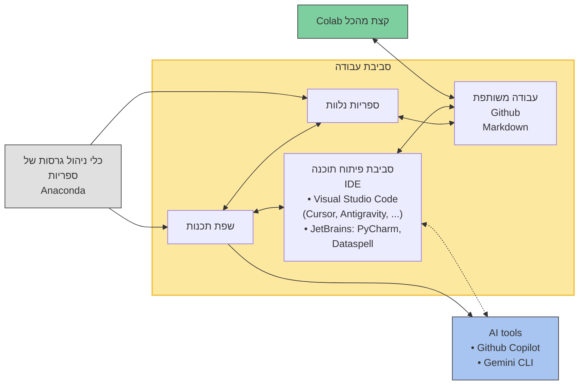

## Python course, 2026
* This page is used for supplementary course information and materials (TA resources).

---

### Meetings
#### Week 1 (12/03) 
* Course introduction
* [Github Skill](https://learn.github.com/skills) 
  * [Introduction to GitHub](https://github.com/skills/introduction-to-github)
  * [Communicate using Markdown](https://github.com/skills/communicate-using-markdown)

---

### Project
The project will be presented at the end of the course 11/06. More details will be provided during the course.
* [Guidelines](/suppl/python/ta2026/Python_Project.pdf)

---

### [Recommended resources](/suppl/python/python_resources2026)

---

### [Old Recordings](/suppl/python/recordings)

---